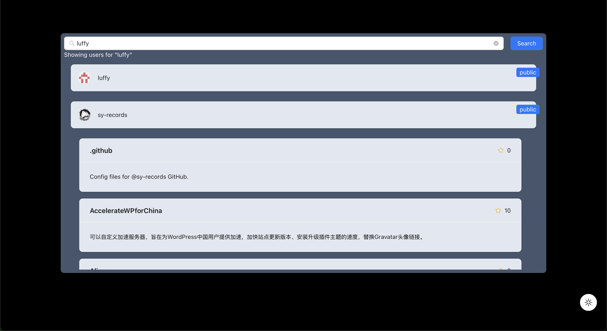

## Getting Started

This is a [Git Explorer](https://gitt-explorer.netlify.app/) project test which search users in github and display their repository.

### 📢 Features
- 🔍 Search for GitHub users by username.
- 📂 View repositories of a selected user.
- 🎨 Smooth animations and UI enhancements.
- 🌐 Hosted on GitHub Pages.

### 📦  Running Locally
First, run the development server:

```bash
npm run dev
# or
yarn dev
# or
pnpm dev
# or
bun dev
```

Open [http://localhost:3000](http://localhost:3000) with your browser to see the result.

## Result
| Feature  | Description | Preview | Dark Mode |
|----------|------------|---------|---------|
| 🔍 Search Init | Init of Find GitHub users by username. |  |   |
| 🔍 Search Users | Find GitHub users by username. |  |   |
| 📂 View Repos | Display user repositories. |  |   |